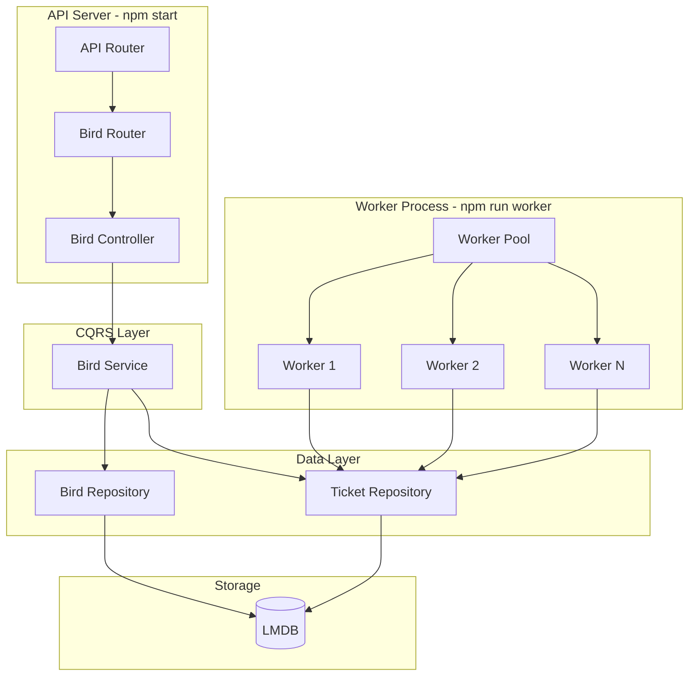

# WorkHero

A Node.js + Express backend implementing a CQRS pattern with a durable job queue backed by LMDB. Workers fetch bird summaries from the [Wikipedia MediaWiki API](https://www.mediawiki.org/wiki/API:Main_page).

## Architecture



## API Endpoints

### `POST /bird`

Create a bird job and enqueue it for processing.

**Request:**

```json
{ "name": "brown pelican" }
```

**Response (201):**

```json
{
  "id": "01961a2b-...",
  "name": "brown pelican",
  "status": "queued",
  "createdAt": "2025-01-01T00:00:00.000Z"
}
```

### `GET /bird?name=brown%20pelican`

Get the result of a completed bird job by name.

**Response (200)** — when the job is completed:

```json
{
  "id": "01961a2b-...",
  "name": "brown pelican",
  "status": "completed",
  "createdAt": "2025-01-01T00:00:00.000Z",
  "result": {
    "title": "Brown pelican",
    "extract": "The brown pelican (Pelecanus occidentalis) is a bird of the pelican family...",
    "fetchedAt": "2025-01-01T00:00:05.000Z"
  }
}
```

**Response (404)** — when the job is not yet finished or does not exist.

## Prerequisites

- [Node.js](https://nodejs.org/) v18+
- [pnpm](https://pnpm.io/) v10+

## Quick Start (Local)

```bash
# 1. Clone the repo
git clone <repo-url> && cd workhero

# 2. Install dependencies
pnpm install

# 3. Copy env file and tweak if needed
cp .env.example .env

# 4. Build the project
pnpm build

# 5. Terminal 1: Start the API server
pnpm dev

# 6. Terminal 2: Start the worker process (5 concurrent workers)
WORKER_CONCURRENCY=5 pnpm run dev:worker
```

## Try It Out

Once both the API and worker are running:

```bash
# Create a bird research job
curl -X POST http://localhost:3000/bird \
  -H "Content-Type: application/json" \
  -d '{"name": "brown pelican"}'

# Wait a few seconds for the worker to process, then fetch the result
curl "http://localhost:3000/bird?name=brown%20pelican"

# Health check
curl http://localhost:3000/health
```

Or open **http://localhost:3000/docs** for the interactive Swagger UI.

**Tracing:** Each `POST /bird` response includes a `traceId`. Grep your logs for `[trace:${traceId}]` to see the full flow:

```
[trace:a1b2c3d4] request {"method":"POST","path":"/bird","name":"brown pelican"}
[trace:a1b2c3d4] created {"birdId":"019c68b6-...","name":"brown pelican","status":"queued"}
[trace:a1b2c3d4] worker_claimed {"ticketId":"...","attempt":1}
[trace:a1b2c3d4] worker_processing {"ticketId":"..."}
[trace:a1b2c3d4] worker_completed {"ticketId":"..."}
```

Pass `X-Trace-ID: my-trace` to use your own trace ID.

## Quick Start (Docker)

Requires [Docker](https://www.docker.com/) and Docker Compose.

The API and worker run in the **same container** because LMDB uses memory-mapped files that can't be shared across separate containers.

```bash
# 1. Build and start
docker compose up --build

# 2. In another terminal, try it out
curl -X POST http://localhost:3000/bird \
  -H "Content-Type: application/json" \
  -d '{"name": "brown pelican"}'

# 3. Wait a few seconds, then fetch the result
curl "http://localhost:3000/bird?name=brown%20pelican"

# 4. Swagger UI
open http://localhost:3000/docs

# Adjust worker concurrency (default 5)
WORKER_CONCURRENCY=10 docker compose up --build

# Stop everything
docker compose down

# Wipe LMDB data
docker compose down -v
```

## Running Tests

```bash
pnpm test
```

Tests use temporary LMDB directories (created and cleaned up per test) so they don't touch your dev data.

| Category | File | What it covers |
|----------|------|----------------|
| Unit | `__tests__/unit/bird-repository.test.ts` | CRUD, name lookup, status updates, edge cases |
| Unit | `__tests__/unit/ticket-repository.test.ts` | Create, claim, complete, fail |
| Unit | `__tests__/unit/bird-service.test.ts` | Create command, idempotency, query before/after completion |
| Concurrency | `__tests__/concurrency.test.ts` | 50 tickets + 20 simultaneous workers, proves no double-claiming |
| Integration | `__tests__/integration.test.ts` | Full flow: submit bird, mock Wikipedia, process job, verify completed |
| Resilience | `__tests__/resilience.test.ts` | LMDB durability: queued/processing tickets survive DB close + reopen |

## Scripts

| Script | Description |
|--------|-------------|
| `pnpm dev` | Start API server with hot-reload |
| `pnpm run dev:worker` | Start worker process with hot-reload (5 concurrent) |
| `pnpm test` | Run full test suite (unit, concurrency, integration, resilience) |
| `pnpm build` | Compile TypeScript to `dist/` |
| `pnpm start` | Run compiled API server |
| `pnpm run worker` | Run compiled worker process |
| `pnpm run db:clear` | Delete LMDB data directory (for testing) |

## Project Structure

Uses **pnpm workspaces** with three packages:

- **@workhero/db** — LMDB connection and models
- **@workhero/repositories** — BirdRepository, TicketRepository
- **@workhero/queue** — processBirdJob, runWorkerLoop

See [filepath.md](filepath.md) for a detailed file map.

## Data Source

Workers fetch bird intro summaries from Wikipedia's MediaWiki API:

```
GET https://en.wikipedia.org/w/api.php?action=query&prop=extracts&exintro=1&explaintext=1&redirects=1&titles={name}&format=json&formatversion=2
```

The architecture is designed for long-running research tasks — the durable queue and separate worker process mean the API stays responsive while workers handle the heavy lifting.

## How the Queue Works

1. **POST /bird** creates a bird entity and a ticket with status `queued` (idempotent: duplicate names return existing job)
2. Worker processes poll for `queued` tickets
3. A worker atomically claims a ticket (LMDB transaction ensures only one worker gets it)
4. The worker fetches the bird's Wikipedia summary and marks the ticket as `completed` with the result
5. **GET /bird?name=X** returns the result once processing is done

## Reliability

- **Idempotency**: Duplicate POST requests with the same bird name return the existing job
- **Atomic claims**: LMDB synchronous transactions prevent multiple workers from claiming the same ticket
- **Graceful shutdown**: API stops accepting new connections and waits for in-flight requests; workers finish current job before exiting on SIGTERM/SIGINT

## What I'd Do Next

With more time, I would add:

- **Dead letter queue** — separate LMDB table for tickets that exhaust retries, with `GET /dead-letters` for inspection and `POST /dead-letters/:id/replay` to re-queue
- **Rate limiting** on the Wikipedia API to avoid being blocked
- **Node.js cluster** or separate process scaling for CPU-bound research tasks
- **agents** langchain web tools for research
- **nginx** reverse proxy — load balancing, rate limiting, SSL termination
- **dashboard** Web UI to view LMDB state and worker activity in real time, instead of polling APIs and tailing logs
